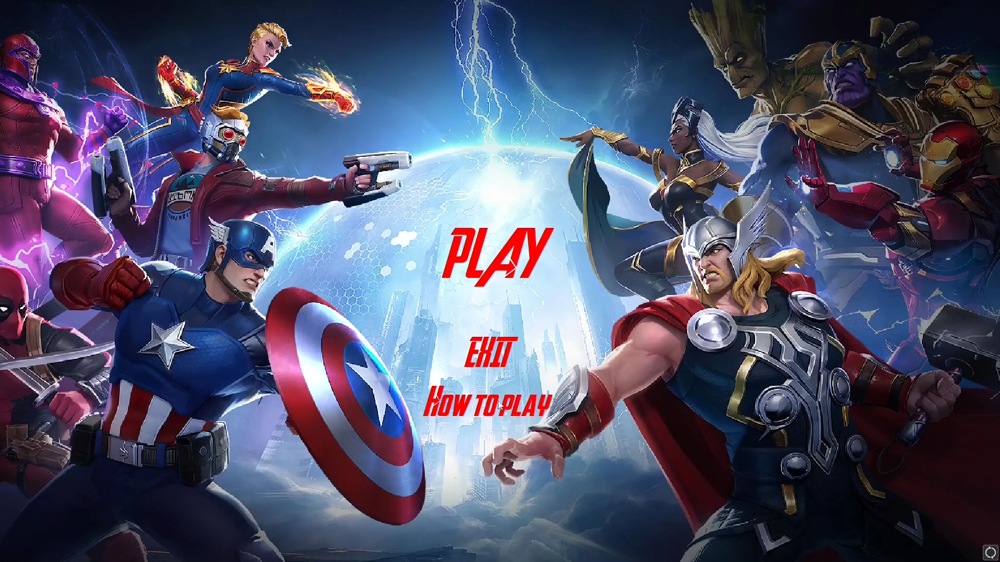
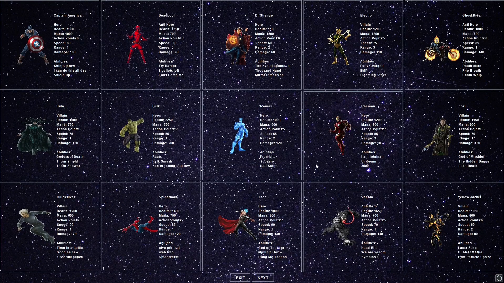
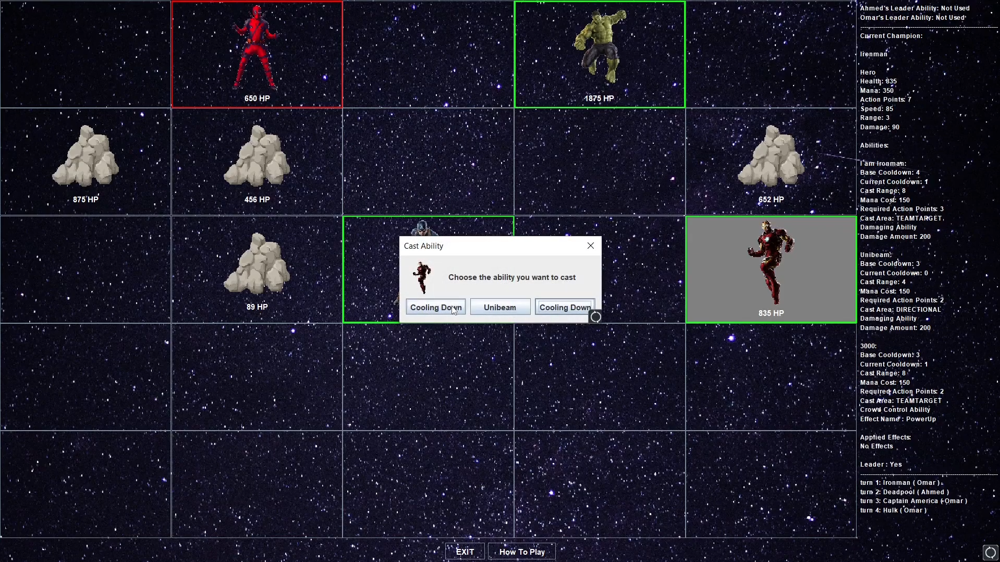

# 🦸‍♂️ Marvel Ultimate War 🦹‍♀️  
*A Marvel-themed 2-player turn-based board game built in Java*


## 🎮 Game Overview

**Marvel Ultimate War** is a Java-based turn-based strategy game inspired by the Marvel universe. Two players face off on a 5x5 tile board using superhero characters with unique abilities. The objective: outsmart your opponent using strategic movement, attacks, and defense mechanisms.



## 🛠️ Technologies Used

- **Java** – Core logic and object-oriented design
- **Java Swing** – For building the graphical user interface (`JFrame`, `JPanel`, `JButton`, etc.)
- **OOP Concepts** – Encapsulation, inheritance, and polymorphism
- **Design Patterns** – Strategy Pattern for character abilities and actions
- **Custom Event Handling** – For responsive and interactive gameplay

## 🧠 Key Features

- 2-player local gameplay with turn-based mechanics
- Multiple Marvel superheroes with unique powers
- Tile-based movement on a 5x5 game board
- Character selection and real-time stat display
- Intuitive GUI with responsive buttons and highlights
- Modular and extendable codebase for adding new characters or abilities

## 📷 Screenshots

| Character Selection | In-Game Action |
|---------------------|----------------|
|  |  |

## 🎥 Demo

> _[Insert gameplay video link here, e.g., YouTube or local GIF]_  
> _You can add a short GIF or video showing character selection, movement, and an attack._

## 🚀 Getting Started

### Prerequisites

- Java 8 or higher
- IDE like IntelliJ IDEA, Eclipse, or VS Code

### How to Run

1. Clone the repository:
    ```bash
    git clone https://github.com/yourusername/marvel-ultimate-war.git
    cd marvel-ultimate-war
    ```
2. Open in your favorite IDE and run `Main.java`

> 💡 If you’re using an IDE, make sure all `.java` files are in the correct package/folder structure.

## 👨‍💻 Code Structure

```bash
marvel-ultimate-war/
│
├── src/
│   ├── game/           # Core game logic
│   ├── ui/             # GUI components
│   ├── characters/     # Marvel character classes
│   └── Main.java       # Main entry point
├── screenshots/        # Screenshots used in README
└── README.md
